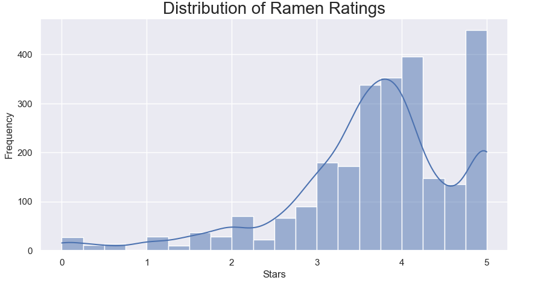
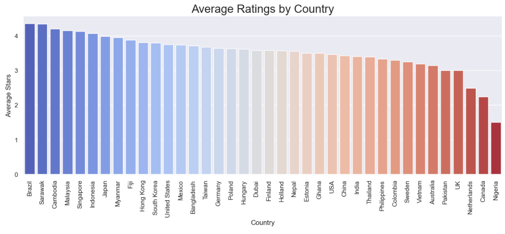
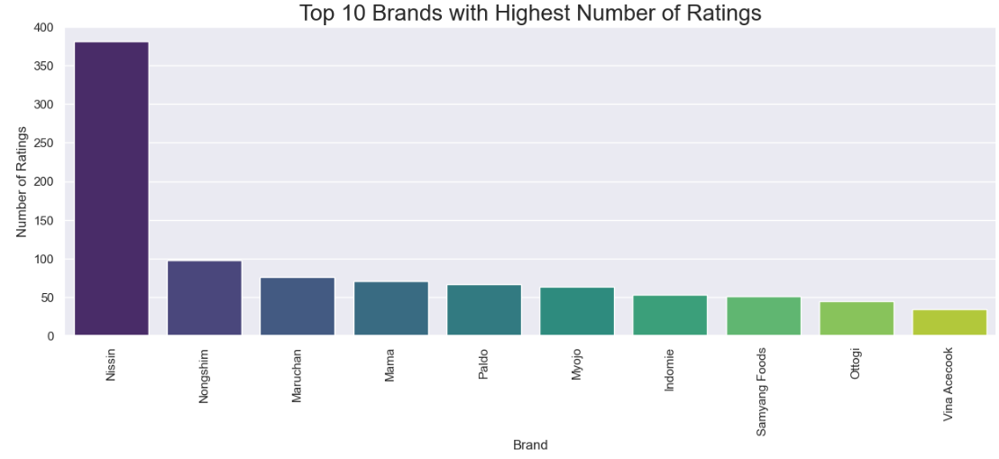
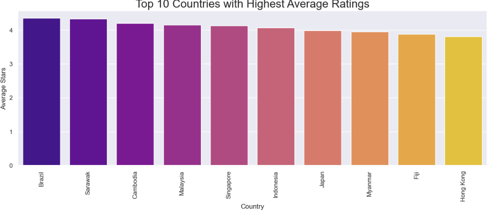
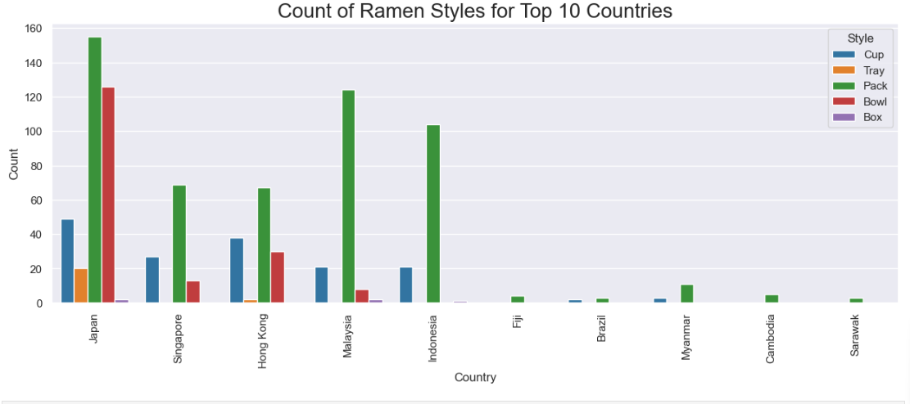
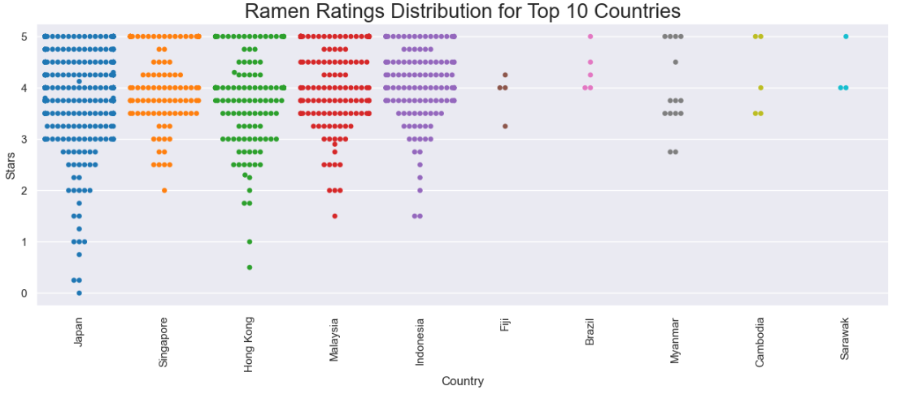
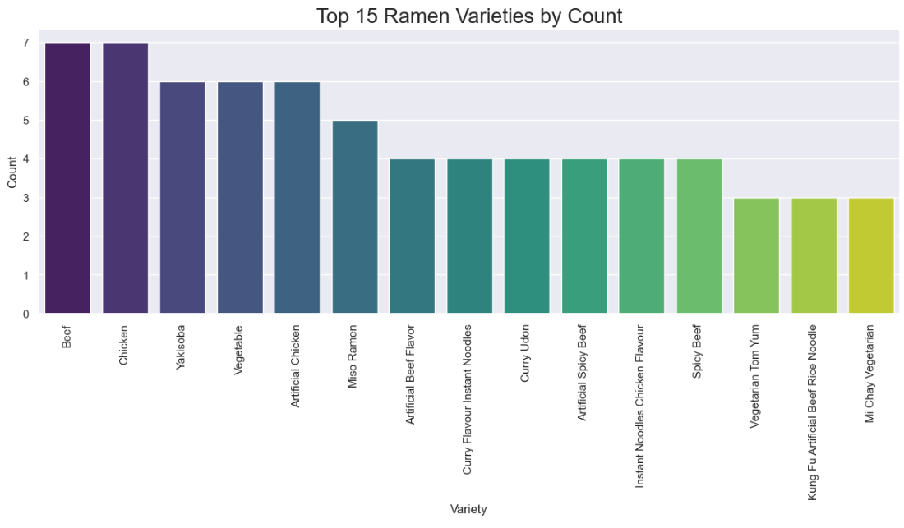
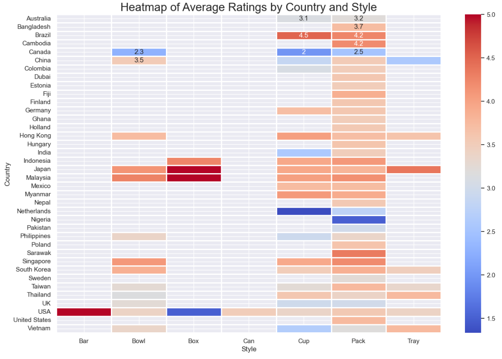
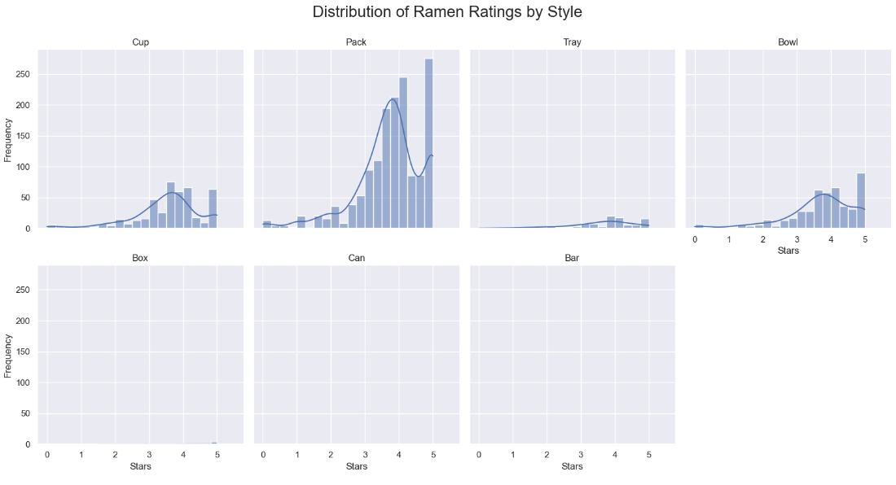
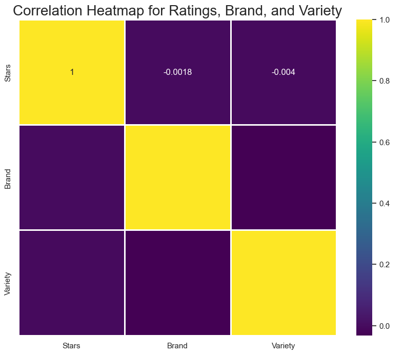

# Celebal_Assignment3

# Ramen Ratings Analysis


## Overview

This project aims to analyze and visualize the Ramen Ratings dataset. The dataset contains various ratings for different ramen brands from different countries. The analysis includes data cleaning, processing, and several visualizations to gain insights into the data.

## Dataset

The dataset used in this project is `ramen-ratings.csv`. It includes the following columns:

- `Review #`: Unique identifier for each review.
- `Brand`: Brand of the ramen.
- `Variety`: Variety of the ramen.
- `Style`: Style of the ramen (e.g., Pack, Bowl, Cup).
- `Country`: Country where the ramen is from.
- `Stars`: Rating of the ramen.
- `Top Ten`: Indicates if the ramen is in the top ten of any year.

## Setup

### Prerequisites

Ensure you have the following packages installed:

- numpy
- pandas
- matplotlib
- seaborn

You can install these packages using pip:

```bash
pip install numpy pandas matplotlib seaborn
```

### Running the Analysis

1. Clone the repository and navigate to the project directory:

    ```bash
    git clone https://github.com/your-username/Assignment3.git
    cd ramen
    ```

2. Ensure the dataset `ramen-ratings.csv` is placed in the appropriate directory.
3. Run the analysis script in a Python environment (e.g., Jupyter Notebook or directly as a Python script).

## Analysis and Visualizations

The analysis script performs the following steps:

1. **Data Loading and Initial Exploration**
    - Load the dataset using pandas.
    - Display the first 10 rows of the dataset.
    - Check the shape and presence of missing values.

2. **Data Cleaning**
    - Drop rows where `Style` is NaN.
    - Convert the `Stars` column to numeric, coercing errors to NaN, and drop remaining NaN values.

3. **Visualizations**
    - Distribution of ramen ratings.
    - Top 10 brands with the highest number of ratings.
    - Average ratings by country.
    - Top 10 countries with the highest average ratings.
    - Count of ramen styles for the top 10 countries.
    - Swarmplot of ramen ratings for top 10 countries.
    - Top 10 ramen varieties by count.
    - Heatmap of average ratings by country and style.
    - Facet Grid of Ramen Ratings Distribution by Style.
    - Correlation Heatmap for Ratings, Brand, and Variety.

### Output Visualizations

1. **Distribution of Ramen Ratings**

   

2. **Top 10 Brands with Highest Number of Ratings**

   

3. **Average Ratings by Country**

   

4. **Top 10 Countries with Highest Average Ratings**

   

5. **Count of Ramen Styles for Top 10 Countries**

   

6. **Swarmplot of ramen ratings for top 10 countries**

   

7. **Top 15 ramen varieties by count**

   

8. **Heatmap of average ratings by country and style**

   

9. **Facet Grid of Ramen Ratings Distribution by Style**

   

10. **Correlation Heatmap for Ratings, Brand, and Variety**

   
   
## Conclusion

This project provides an in-depth analysis of the Ramen Ratings dataset, offering insights into the distribution of ratings, popular brands, and the performance of ramen from different countries. The visualizations help in understanding the trends and patterns in the data.

## License

This project is licensed under the MIT License - see the [LICENSE](LICENSE) file for details.

## Acknowledgements

- The dataset used in this project is sourced from [The Ramen Rater](https://www.theramenrater.com/).

---


